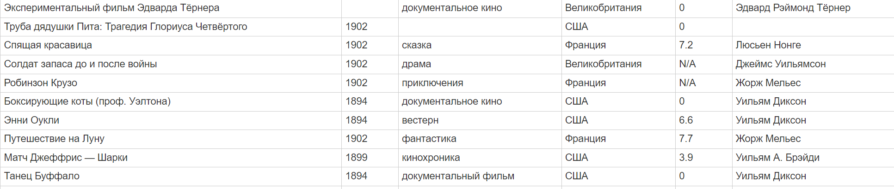

**Парсинг данных на scrapy**

Для запуска программы через pycharm следует вызвать:
```python
process = CrawlerProcess()
process.crawl(FilmsSpider)
process.start()
```
Пример запуска уже добавлен в main.py

Для запуска через командную строку:
```shell
YOUR_PATH\pythonProject\.venv\Scripts\python.exe YOUR_PATH\PycharmProjects\pythonProject\main.py 
```
Вместо YOUR_PATH необходимо вставить ваш собственный путь до файла, либо перейти в папку pythonProject и запустить main.py оттуда, не указывая YOUR_PATH.

Пример получившейся таблицы (запрос рейтинга был отключен, т.к. имеет лимит):


csv файл генерируется в папке проекта.

Пример получившейся таблицы с запросом:
